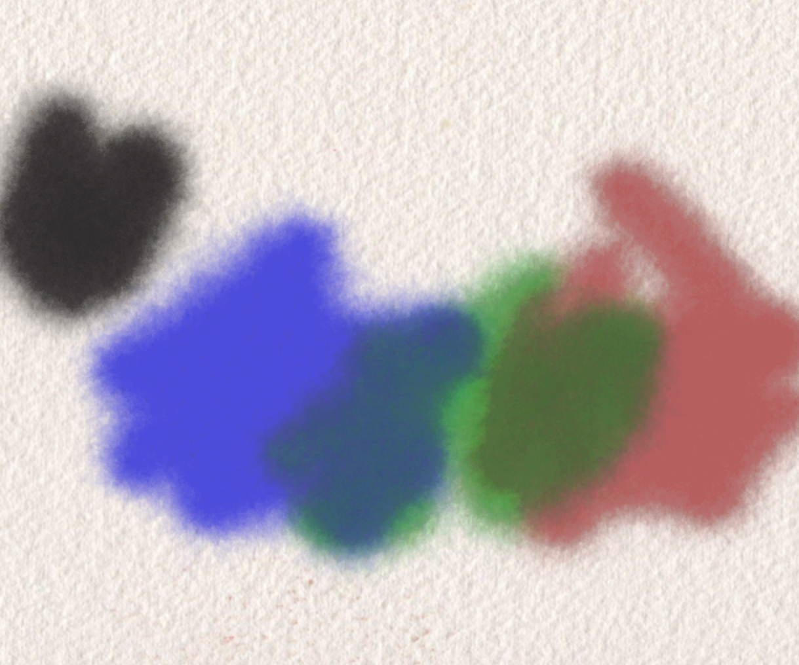

# Sketches

Generative art sketches. Newest first

---

## Blot/Painting [#p5js](https://p5js.org)

 

---
- [code](blot-painting/)
- Based on Esteban Hufstedler's [Ink Splashes](https://estebanhufstedler.com/2018/10/02/splash/)
- Explore it [here](https://rberenguel.github.io/sketches/blot-painting/index.html)

---

## Watercolour [#p5js](https://p5js.org)

---
- [code](watercolour/watercolour.js)
- Based on Tyler Hobb's [polygon deformation](https://tylerxhobbs.com/essays/2017/a-generative-approach-to-simulating-watercolor-paints)
- See it [here](https://rberenguel.github.io/sketches/watercolour/index.html)

---

## Going crazy [#p5js](https://p5js.org)

---
- [code](crazy/crazy.js)
- Based on Anders Hoff's [Sand Splines](https://inconvergent.net/generative/sand-spline/)
- See it here [here](https://rberenguel.github.io/sketches/crazy/index.html)

---

## Conway's Game of Life [#p5js](https://p5js.org)
- [code](life/life.js)
- See it here [here](https://rberenguel.github.io/sketches/life/index.html)

---

## Sorting myself out [#p5js](https://p5js.org)

---
- [code](sorting/sorting.js) 
- See it [here](https://mostlymaths.net/2020/05/sorting-myself-out.html/index.html)

---

## Hailstorm [#p5js](https://p5js.org)

---
- [code](hailstorm/hailstorm.js) 
- See it [here](https://rberenguel.github.io/sketches/hailstorm/index.html)
