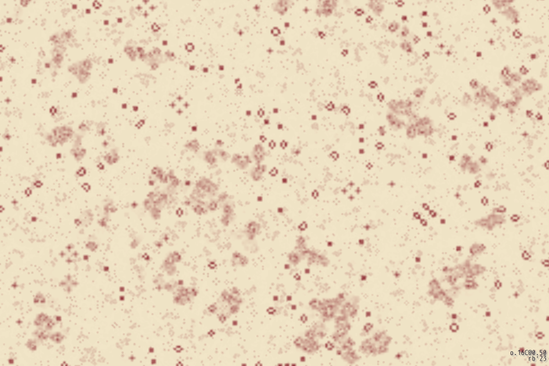
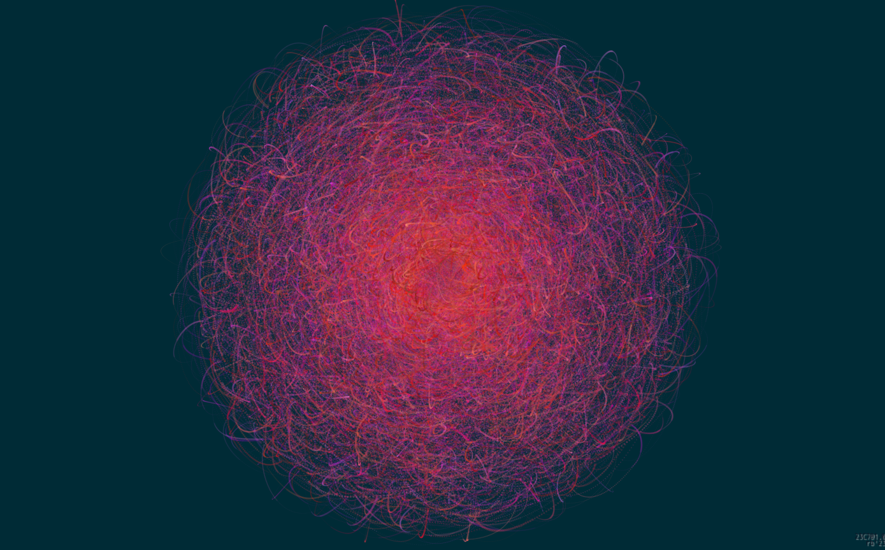
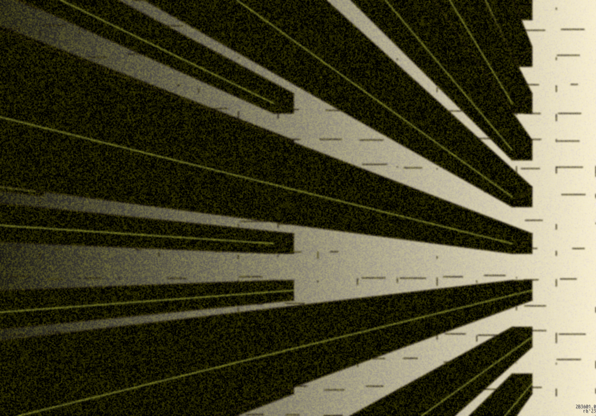
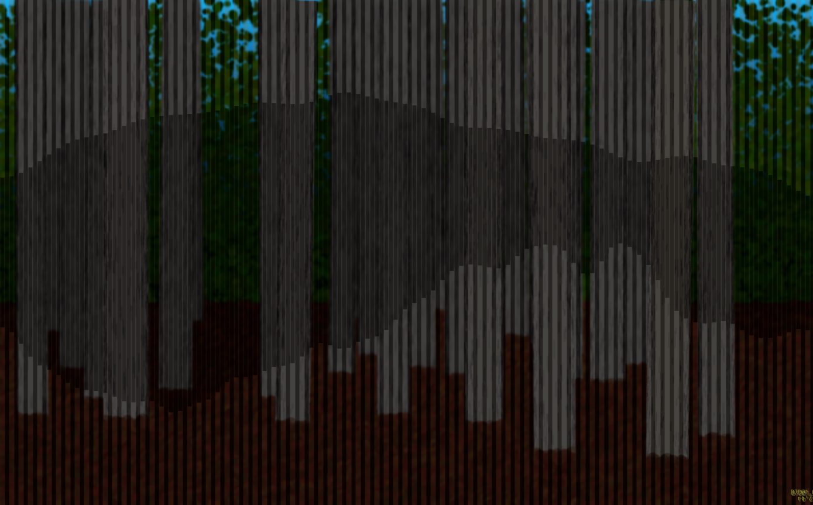
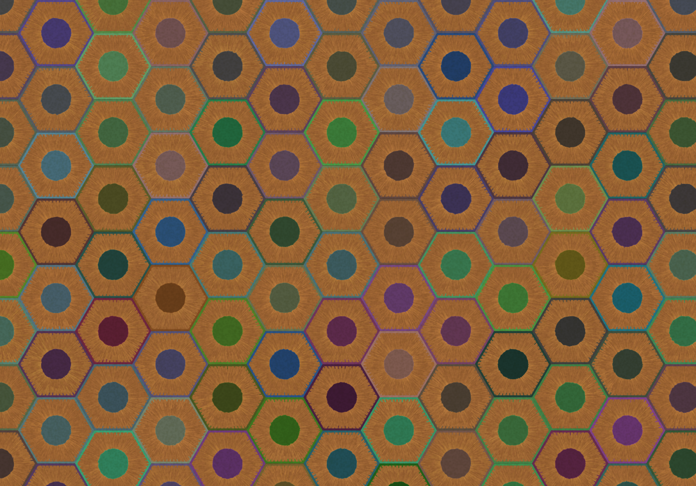

# Sketches

Generative art sketches. Newest first

---

## 202306 - Lif &#127464&#127469 [#p5js](https://p5js.org)

---

- Conway's game of life in a shader. The code has comments to remember how I did this because it took me a while
- [code](lif/lif.js) Not resolution independent
- Explore it [here](https://rberenguel.github.io/sketches/lif/index.html)
- NEW [See in place](https://rberenguel.github.io/sketches/showcasing/index.html?img=lif)

---

## 202305 - Creation &#127464&#127469 [#p5js](https://p5js.org)

---

- Just random curves on random circle radii
- [code](creation/creation.js) Resolution independent-ish.
- Explore it [here](https://rberenguel.github.io/sketches/creation/index.html)
- NEW [See in place](https://rberenguel.github.io/sketches/showcasing/index.html?img=creation)

---

## 202305 - Temple &#127464&#127469 [#p5js](https://p5js.org)

---

- Inspired by what became 'Impossible Distance' by <a href='https://twitter.com/ippsketch/status/1645884276158636040?s=61&t=8Ko3mXJTcDWYao4IgQoBBg'>Ippsketch</a>
- [code](temple/temple.js) Resolution independent-ish.
- Explore it [here](https://rberenguel.github.io/sketches/temple/index.html)
- NEW [See in place](https://rberenguel.github.io/sketches/showcasing/index.html?img=temple)

---

## 202305 - (Through)&sup2; the trees &#127464&#127469 [#p5js](https://p5js.org)

---

- Uses several of the tricks in Bubbles below (stacked blurs, stacked randoms)
- [code](through2/through2.js) Resolution independent, but only reproducible at the exact same resolution factor.
- Explore it [here](https://rberenguel.github.io/sketches/through2/index.html)
- NEW [See in place](https://rberenguel.github.io/sketches/showcasing/index.html?img=through2)

---

## 202305 - Bubbles [#p5js](https://p5js.org)

---

- Based on [these random random distributions on a circle](https://openprocessing.org/sketch/1575230/).
- [code](bubbles/bubbles.js) Resolution independent, but only reproducible at the exact same resolution factor.
- Explore it [here](https://rberenguel.github.io/sketches/bubbles/index.html)
- NEW [See in place](https://rberenguel.github.io/sketches/showcasing/index.html?img=bubbles)

---

## 202305 - Out of Fabric [#p5js](https://p5js.org)

---

- Taking the applique effect in Modern Art to the next (and very memory intensive) level.
- [code](out-of-fabric/out-of-fabric.js) Resolution independent, but controls are disabled: placement of stalks and flowers is not well calibrated for other resolutions than 1x. Also, can't go higher than 1.5 on iPad due to canvas memory constraints. Did I say it is memory intensive?
- Explore it [here](https://rberenguel.github.io/sketches/out-of-fabric/index.html)
- NEW [See in place](https://rberenguel.github.io/sketches/showcasing/index.html?img=out-of-fabric)

---

## 202305 - Underwater [#p5js](https://p5js.org)

---

- A "simple" piece of random triangles where I wanted to explore a dotted effect and what I could do "smartly" with masking. It is also the first piece that is fully resolution independent and reproducible at any scale with only very minor variations
- [code](underwater/underwater.js) Fully resolution independent, with signature (this time as an hex identifier for the seed).
- Explore it [here](https://rberenguel.github.io/sketches/underwater/index.html)
- NEW [See in place](https://rberenguel.github.io/sketches/showcasing/index.html?img=underwater)

---

## 202304 - Flows [#p5js](https://p5js.org)

---

- Layered particle flow in a noise field. Variable size and alpha of the dots gives it a grainy, painterly look
- [code](flows/flows.js) Resolution independent and the first (so far) reproducible via seed and parameters, see the lower-right area of a saved image.
- Explore it [here](https://rberenguel.github.io/sketches/flows/index.html)

---

## 202304 - Modern Art [#p5js](https://p5js.org)

---

- I was going to work on a renewed embroidery sketch and ended up with this cloth texture generator
- [code](modern-art/modern-art.js) This is not resolution independent even if it has the controls in place. Could be made to be, though.
- Explore it [here](https://rberenguel.github.io/sketches/modern-art/index.html)

---

## 202304 - La Truche [#p5js](https://p5js.org)

---

- While thinking about hiking up to [La Truche](https://maps.app.goo.gl/i4XqRKm9TkGFzD9T8?g_st=ic), I thought about [Truchet](https://en.m.wikipedia.org/wiki/Truchet_tiles) tiles. To make them local, I used the color palette of [an old Swiss map](https://map.geo.admin.ch/?topic=swisstopo&lang=en&bgLayer=voidLayer&layers=ch.swisstopo.zeitreihen&layers_timestamp=18811231&zoom=10&time=1881&E=2575089.75&N=1131965.38) and some fake syllabic generated names.
- [code](la-truche/truche.js) This is not resolution independent even if it has the controls in place. Could be made to be, though.
- Explore it [here](https://rberenguel.github.io/sketches/la-truche/index.html)

---

## 202304 - Stained [#p5js](https://p5js.org)

---

- I have a project that needs generative stained glass, so here it is
- [code](stained/stained.js) This should be resolution independent (except for the noise in the metal) but haven't really tried
- Explore it [here](https://rberenguel.github.io/sketches/stained/index.html)

---

## 202304 - Synthwave [#p5js](https://p5js.org)

---

- Reusing the most annoying parts of 70s Patch below; but adding additional faces to the ridges (although without many failsafes for collision). Also has a custom glow for the terrain (I blame Safari on having to do that)
- [code](synthwave/synthwave-hd.js) This should be largely resolution independent code
- Explore it [here](https://rberenguel.github.io/sketches/synthwave/index.html)

---

## 202303 - 70s Patch [#p5js](https://p5js.org)

---

- Inspired on [Panoramas](https://www.reddit.com/r/generative/comments/p0tvfu/generated_panorama_drawings_p5js) by [estienne_ca](https://twitter.com/estienne_ca). Has some interesting techniques.
- [code](70s-patch/70s-hd.js) This should be largely resolution independent code
- Explore it [here](https://rberenguel.github.io/sketches/70s-patch/index.html)

---

## 202303 - Pencils [#p5js](https://p5js.org)

---

- Based on [this](https://twitter.com/meezwhite/status/1611791711969181697?s=12&t=ym-awO5tGUYR8G03Ua4bww) 2023 Genuary entry by [meezwhite](https://twitter.com/meezwhite). A large part of the mechanics are based on [Iris](#Iris).
- [code](pencils/pencils-hd.js) This should be largely resolution independent code
- Explore it [here](https://rberenguel.github.io/sketches/pencils/index.html)

---

## 2021?? - Fakembroidery [#p5js](https://p5js.org)

---

- Based on this [Houdini tutorial for generative embroidery](https://www.sidefx.com/tutorials/fakebroidery/), reusing the palette sketch (below) for color quantization. I wrote this several months ago and meant to rewrite it and improve it, but it never happened. Since so much time has passed, I decided to publish it, maybe somebody finds it useful.
- [code](embroided/embroided.js)
- Explore it [here](https://rberenguel.github.io/sketches/embroided/index.html)

---

## 202101 - DoF [#p5js](https://p5js.org)

---

- Tweakings from the code in [11th Codecember 2020](https://codecember.ink/2020/11) (in turn based in [Depth of Field by Anders Hoff](https://inconvergent.net/2019/depth-of-field/))
- [code](dof/dof.js)
- Explore it [here](https://rberenguel.github.io/sketches/dof/index.html)

---

## 202008 - Chord diagram [#d3js/v6](https://d3js.org)

 

---

- D3 chord diagram with zoom and pan
- [code](chord/chord.js)
- Find the code for the chord matrix computation in the Python notebook [here](chord/)
- Explore it [here](https://rberenguel.github.io/sketches/chord/index.html)

---

## 202006 - Iris [#p5js](https://p5js.org)

 

---
- Generative irises
- [code](iris/iris-hd.js) (new version, this should be resolution independent code)
- Explore it [here](https://rberenguel.github.io/sketches/iris/index.html)
- You can read a blog post about it [here](https://mostlymaths.net/2020/06/iris-sketch.html/).

---

## 202005 - Crazy nights [#p5js](https://p5js.org)

 

---
- Star field simulation that grew into rolling hills and "moon"
- [code](nights/nights.js)
- Explore it [here](https://rberenguel.github.io/sketches/nights/index.html)

---

## 202005 - Divide et impera [#p5js](https://p5js.org)

 

---
- [code](divide/divide.js)
- Color treemap via naive k-means palette extraction below
- Explore it [here](https://rberenguel.github.io/sketches/divide/index.html)

---

## 202005 - Palette [#p5js](https://p5js.org)

 

---
- Naive k-means palette extraction. Offers two modes (centroid or closest color to centroid) and allows you to use your own images and change the number of clusters
- [code](palette/palette.js)
- Explore it [here](https://rberenguel.github.io/sketches/palette/index.html)

---

## 202005 - Blot/Painting [#p5js](https://p5js.org)

 

---
- Based on Esteban Hufstedler's [Ink Splashes](https://estebanhufstedler.com/2018/10/02/splash/)
- [code](blot-painting/)
- Explore it [here](https://rberenguel.github.io/sketches/blot-painting/index.html)
- You can read a blog post about it [here](https://mostlymaths.net/2020/05/blot-painting-p5js-sketch.html/).

---

## 202005 - Watercolour [#p5js](https://p5js.org)

---
- Based on Tyler Hobb's [polygon deformation](https://tylerxhobbs.com/essays/2017/a-generative-approach-to-simulating-watercolor-paints)
- [code](watercolour/watercolour.js)
- See it [here](https://rberenguel.github.io/sketches/watercolour/index.html)

---

## 202005 - Going crazy [#p5js](https://p5js.org)

---
- Based on Anders Hoff's [Sand Splines](https://inconvergent.net/generative/sand-spline/)
- [code](crazy/crazy.js)
- See it here [here](https://rberenguel.github.io/sketches/crazy/index.html)

---

## 202005 - Conway's Game of Life [#p5js](https://p5js.org)
- [code](life/life.js)
- See it here [here](https://rberenguel.github.io/sketches/life/index.html)

---

## 202005 - Sorting myself out [#p5js](https://p5js.org)

---
- [code](sorting/sorting.js) 
- See it [here](https://mostlymaths.net/2020/05/sorting-myself-out.html/index.html)

---

## 202005 - Hailstorm [#p5js](https://p5js.org)

---
- [code](hailstorm/hailstorm.js) 
- See it [here](https://rberenguel.github.io/sketches/hailstorm/index.html)
